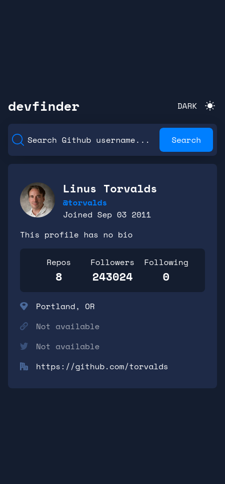
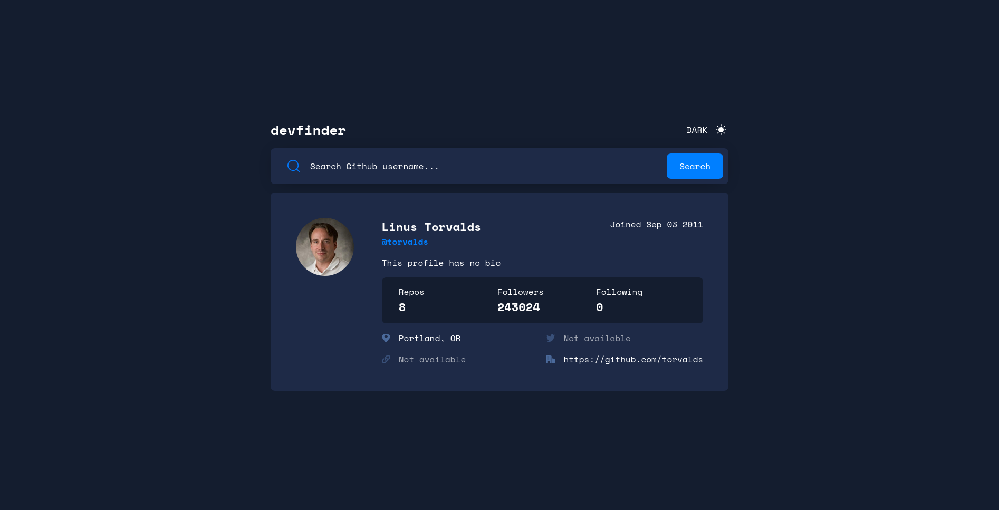

# Frontend Mentor - GitHub user search app solution

This is a solution to the [GitHub user search app challenge on Frontend Mentor](https://www.frontendmentor.io/challenges/github-user-search-app-Q09YOgaH6). Frontend Mentor challenges help you improve your coding skills by building realistic projects.

## Table of contents

- [Overview](#overview)
  - [The challenge](#the-challenge)
  - [Screenshot](#screenshot)
  - [Links](#links)
- [My process](#my-process)
  - [Built with](#built-with)
  - [What I learned](#what-i-learned)
  - [Useful resources](#useful-resources)
- [Author](#author)

## Overview

### The challenge

Users should be able to:

- View the optimal layout for the app depending on their device's screen size
- See hover states for all interactive elements on the page
- Search for GitHub users by their username
- See relevant user information based on their search
- Switch between light and dark themes

### Screenshot


- Mobile Screen light



- Mobile Screen dark


- Tablet Screen light


- Tablet Screen dark


- Desktop Screen light



- Desktop Screen dark

### Links

- Solution URL: [Solution](https://github.com/ZTanvir/frontend-mentor-github-user-search-app)
- Live Site URL: [Live](https://carvalhovincent.github.io/GitHub-user-search-app/)

## My process

### Built with

- Semantic HTML5 markup
- CSS custom properties
- Flexbox
- CSS Grid
- Mobile-first workflow
- [React](https://reactjs.org/) - JS library

### What I learned

I can add light and dark theme to the website.

```css
.dark-theme {
  --bg-color-white: var(--color-mirage);
  --bg-color-romance: var(--color-blue-zodiac);
  --text-color-dark: var(--color-white);
  --text-color-light: var(--color-romance);
  --text-input-placeholder: var(--color-white);
  --user-data-bg-color: var(--color-mirage);
  --loader-border-color: rgba(255, 255, 255, 0.3);
  --loader-border-top-color: #ffffff;
}
```

By adding transition effect to the element , so when a element go through one state to another it become smooth.

```css
body {
  background-color: var(--bg-color-white);
  transition: background-color 0.5s ease-in-out;
}
```

### Useful resources

- [MDN](https://developer.mozilla.org/en-US/) - This is an site helped me finally understand many css topics. I'd recommend it to anyone still learning this concept.

- [React doc](https://react.dev/) - This is an site helped me understand react context api and their use case. I'd recommend it to anyone still learning this concept.

## Author

- Github - [@ztanvir](https://github.com/ZTanvir)
- Frontend Mentor - [@ZahirulIslamTanvir](https://www.frontendmentor.io/profile/ZahirulIslamTanvir)
